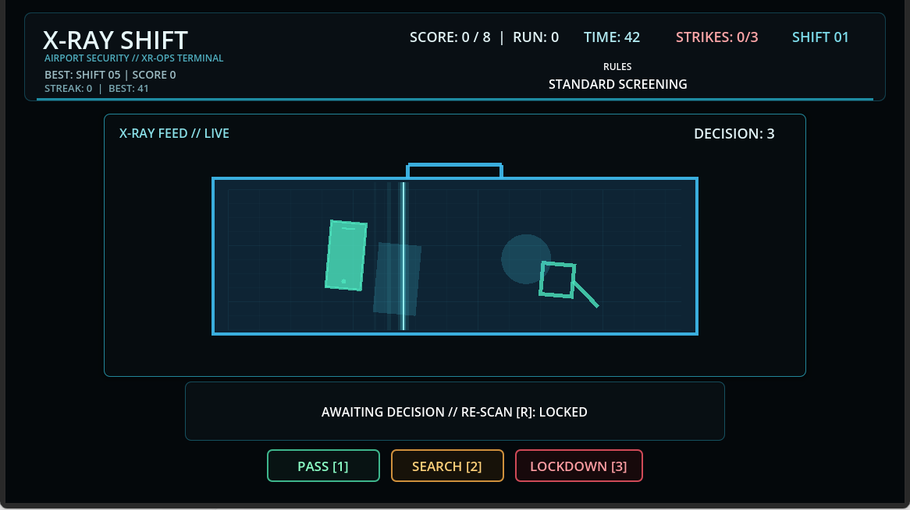
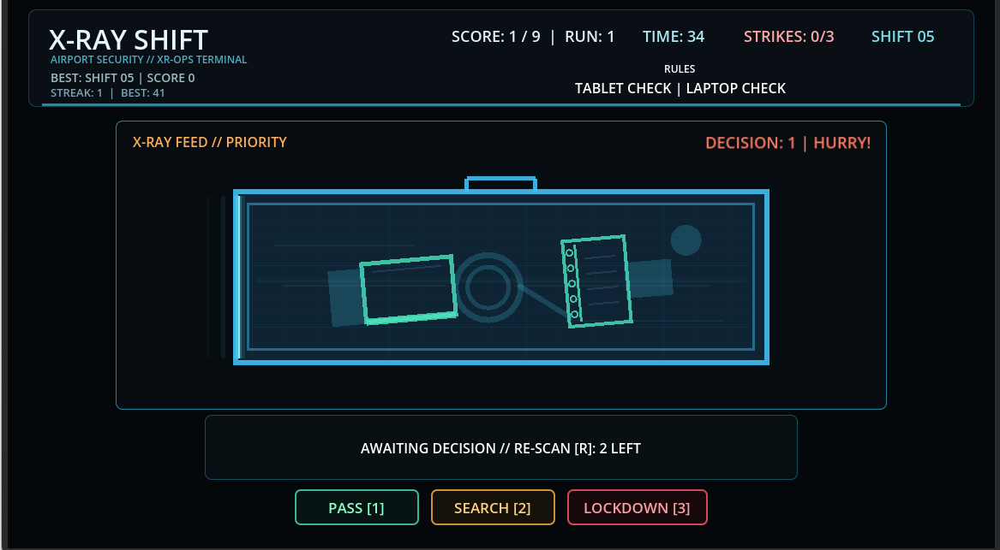
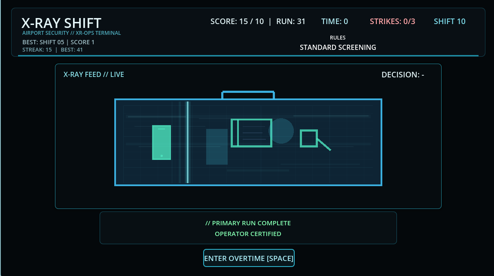

# X-RAY SHIFT

**Inspect the bags. Follow the protocol. Make the call.**

X-RAY SHIFT is an airport security inspection game built with Godot.

Players operate an X-ray screening checkpoint, inspect incoming baggage, and make decisions under time pressure. Each bag must be PASSED, SEARCHED, or placed under LOCKDOWN according to the active security protocols.

As shifts progress, the checkpoint becomes increasingly demanding.

## Gameplay

The core gameplay loop involves:

- Inspecting randomly generated baggage.
- Identifying prohibited items and suspicious anomalies.
- Following the current screening rules.
- Making decisions before time runs out.
- Meeting shift quotas while avoiding strikes.

Correct decisions improve your score. Mistakes put your run at risk.

## Features

- Three core decisions: PASS, SEARCH, and LOCKDOWN.
- Changing airport screening protocols.
- Mid-shift rule updates.
- Limited-use RE-SCAN mechanic.
- Temporary Operator Directives.
- A 10-shift primary run.
- Operator Certification upon completing the primary run.
- Endless Overtime mode after certification.
- Session and decision telemetry for playtest analysis.

## Built With

- Godot Engine 4.6.2
- GDScript
- Python for playtest telemetry analysis
- Git and GitHub for version control

## Controls

| Key | Action |
| --- | --- |
| 1 | PASS |
| 2 | SEARCH |
| 3 | LOCKDOWN |
| R | RE-SCAN, when available |
| ESC | Pause |
| SPACE | Start or continue a shift |

## How to Play

1. Read the briefing before each shift.
2. Inspect the current bag through the X-ray scanner.
3. Check the active screening protocols.
4. Choose the appropriate decision.
5. Reach the quota before time runs out.

Complete Shift 10 to earn Operator Certification and unlock Overtime.

## Windows Download

**Official itch.io page:** [X-RAY SHIFT](https://kilicaslanyusuf.itch.io/x-ray-shift)

The Windows build is publicly available on itch.io.

Download the latest Windows version from the official itch.io page above.

## Development

X-RAY SHIFT is an independently developed game project focused on rapid decision-making, readable visual information, escalating difficulty, and replayability.

The project has been publicly released on itch.io and will continue to receive fixes and improvements based on player feedback.

## Official Gameplay Trailer

Watch X-RAY SHIFT in action: baggage inspection, changing screening protocols, RE-SCAN, time pressure, and Operator Certification.

[▶ Watch the Official Gameplay Trailer on YouTube](https://www.youtube.com/watch?v=K_y6roZqssQ)

---

## Screenshots

### Shift 01 — Standard Screening

### Shift 05 — Priority Screening

### Shift 10 — Operator Certification

## Feedback

Feedback on onboarding, difficulty progression, visual clarity, and replayability is especially valuable during development.
